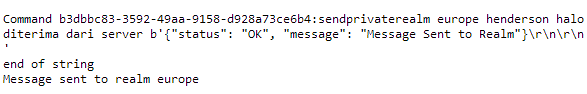

# ChatAppWithFlet

## Contributors

| No  | Name                               | NRP   | Jobdesk |
|-----|------------------------------------|--------------|---------|
| 1   | Gabrielle Immanuel Osvaldo Kurniawan| 5025211135   | Implement protocol chatting & deployment |
| 2   | Sandyatama Fransisna Nugraha       | 5025211196   | Implement Flet Interface & deployment |
| 3   | Andrian                            | 5025211079   | Implement multirealm protocol & deployment |
| 4   | Duevano Fairuz Pandya              | 5025211052   | Implement multirealm protocol & deployment |
| 5   | Aryasatya Wiryawan                 | 5025221256   | Documentation and Testing & deployment |
| 6   | Muhammad febriansyah               | 5025211164   | Documentation and testing & deployment |

## Komponen Utama 

### Server Mesin1
Lokasi Port      : 8889
Lokasi Program   : .ChatAppWithFlet/Mesin1 (Chat App)/ChatServer.py

### Client Mesin1
Ip Destination    : 172.16.16.101
Port Destination  : 8889

### Server Mesin2
Lokasi Port      : 8890
Lokasi Program   : .ChatAppWithFlet/Mesin1 (Chat App)/ChatServer.py

### Client Mesin1
Ip Destination    : 172.16.16.102
Port Destination  : 8890

## Komunikasi dalam satu server

1. Login: `auth [username] [password]` contoh `auth messi surabaya`

2. Register: `register [username] [password] [nama (gunakan "_" untuk seperator) ] [negara]` contoh `register joni admin joni_perkasa Indonesia`

3. Buat group: `addgroup [nama_group]` contoh `addgroup jarkom3`

4. Join group: `joingroup [nama_group]` contoh `joingroup jarkom3`

5. Mengirim pesan private: `send [username to] [message]` contoh `send messi hello world`

6. Mengirim file private: `sendfile [username to] [filename]` contoh `sendfile messi file.txt`

7. Mengirim pesan ke group: `sendgroup [nama_group] [message]` contoh `sendgroup jarkom3 hallo guys welcome`

8. Mengirim file ke group: `sendgroupfile [usernames to] [filename]` contoh `sendgroupfile jarkom3 file.txt`

9. Melihat pesan: `inbox`

10. Logout: `logout`

11. Melihat user yang aktif: `info`

## Komunikasi dengan server lain
  Digunakan command MultiRealm Server agar dapat terkoneksi dengan berbeda server disini kita menggunakan Mesin1 dan Mesin2 dengan layanan yang sama.

  Berikut merupakan beberapa command yang dpat diakses dengan format sebagai berikut:
  
1. Menambah realm                 : `addrealm [nama_realm] [address] [port]` 
2. Mengirim pesan ke realm        : `sendprivaterealm [name_realm] [username to] [message]`
3. Mengirim pesan ke group realm  : `sendgrouprealm [name_realm] [usernames to]/[group:][group_name] [message]`
4. Melihat pesan realm            : `getrealminbox [nama_realm]`
5. Mengirim file ke realm         : `sendfilerealm [name_realm] [username to] [filename]`
6. Mengirim file ke group realm   : `sendgroupfilerealm [name_realm] [usernames to] [filename]`

## Default Information
### Users
- messi        : surabaya (pw)
- henderson    : surabaya (pw)
- lineker      : surabaya (pw)

### Group
- home

### Setup Preparation 
- Buka terlebih dahulu localhost:6000x maupun localhost:5000x
- Dilanjutkan dengan masuk ke salah satu mesin yang ingin digunakan (Bisa mesin1/mesin2/mesin3)
- Lakukan clone repository ini ke dalam jupyter notebook (Disini menggunakan mesin1 = localhost:60001)
- Buka repository dan jalankan server terlebih dahulu dengan perintah `python3 ChatServer.py`
- Setelah server running, maka buka localhost:50001 lalu buka lxterminal
- Arahkan ke direktori ChatAppWithFlet dengan menggunakan mesin yang sama 
- Pastikan server sudah menyala dan running code `flet-dep.sh` menggunakan command `bash`.  
- Lalu jalankan program `flet-chat.py` pada lxterminal 
- Hasilnya akan muncul sebagai berikut 

- Program sudah bisa digunakan 

  note 1: dalam mode UI di gunakan `flet` sehinggga harus dilakukan instalasi terlebih dahulu lalu dilakukan instalasi kembali didalamnya dengan setup yang berbeda tergantung dari spesifikasi pada device. Untuk menjalankan flet dalam lokal, bisa menggunakan command `pip install flet`

  note 2: program yang digunakan, menggunakan docker yang disediakan oleh pak Roy

### Dokumentasi with UI

- ### Tampilan HomeScreen

- ### Tampilan Login

- ### Tampilan Register

- ### Tampilan Info User Tersedia

- ### Proses Create Group 

- ### Proses Private Messaging (Ke Messi)

- ### Proses Private Messaging (Ke Kevin)

- ### Proses Group Messaging (Ke Jarkom)

- ### Proses Group Messaging (Ke Jarkom3)

- ### Proses File Messaging (Ke Rian)

- ### Proses File Messaging (Ke Jarkom)

- ### Hasil Chat Client

- ### Hasil Chat Client 2

- ### Hasil Add Realm

- ### Hasil Chat Realm Mesin1

- ### Hasil Chat Realm Mesin2

- ### Hasil Chat FileRealm

